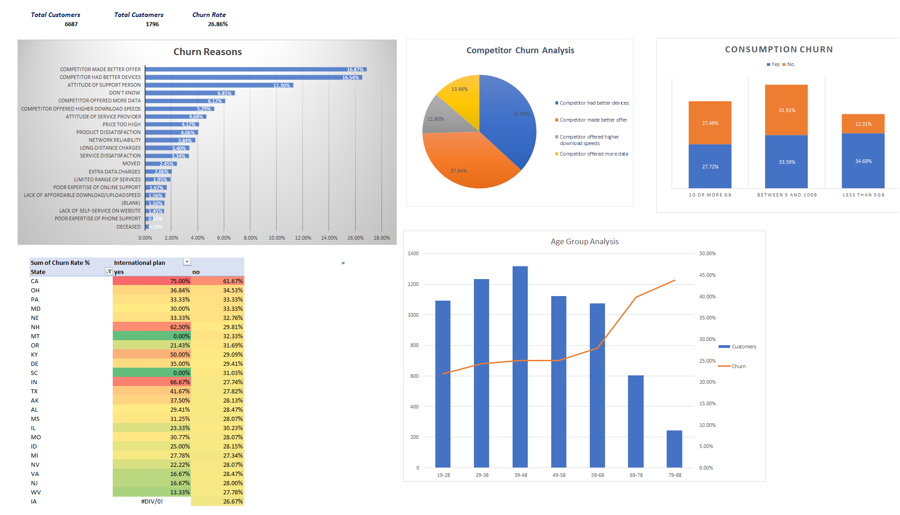
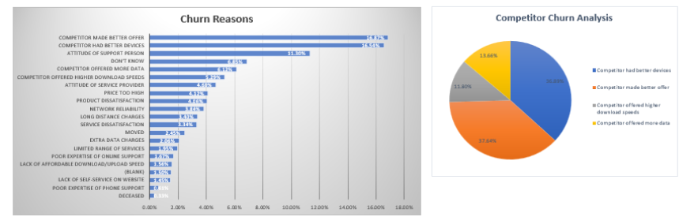
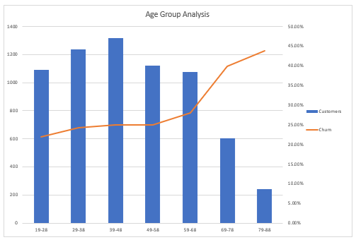
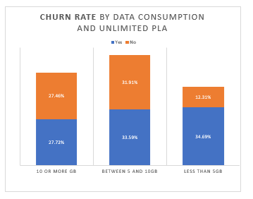

# Customer Churn Analysis

## About the Project

This project analyzes customer churn using a fictional telecommunications dataset.

I approached the project with a simple question: **Why are customers leaving, and are there particular customer groups where churn is more common?**

Using Microsoft Excel, I cleaned and explored the data, created customer segments, investigated churn reasons and patterns, and developed a dashboard to communicate the key findings.

## Business Problem

Knowing that customers are leaving is not enough to make a good business decision. The company also needs to understand **why they are leaving and which groups are most affected**.

My analysis focused on:

- Measuring the overall churn rate.
- Identifying the major reasons for churn.
- Understanding the main churn categories.
- Comparing churn across customer demographics and age groups.
- Investigating patterns across customer plans and data consumption.

## Dataset

The dataset contains customer demographic, account, service usage, and churn information.

After preparing the data:

- **Total Customers:** 6,687
- **Churned Customers:** 1,796
- **Overall Churn Rate:** 26.86%

## Tools & Techniques

The project was completed entirely in **Microsoft Excel**.

I used:

- PivotTables
- PivotCharts
- Calculated Fields
- IFS statements
- COUNTIF
- Conditional Formatting
- Grouping

## My Approach

I started by defining the problem and identifying the questions I wanted the analysis to answer.

I then explored and prepared the data by checking for duplicates and records without useful customer attributes. I also created new categories to make the analysis more meaningful, including demographic groups, 10-year age groups, and broader churn-reason categories.

After preparing the data, I used PivotTables and calculated fields to investigate churn across different customer segments before presenting the main results in an Excel dashboard.

## Dashboard

The dashboard provides an overview of customer churn, highlighting churn reasons, customer demographics, age groups, service usage, and plan-related patterns.

## Key Findings

### 1. Overall Customer Churn
The overall customer churn rate was approximately **26.86%**, representing **1,796 churned customers** out of 6,687 customers.

### 2. Why Are Customers Leaving?
**Competitor-related reasons** accounted for the largest churn category. At the individual-reason level, **"Competitor made better offer"** was the leading reason for churn, closely followed by **"Competitor had better devices."**

This suggests that competitive pressure is an important area for further investigation, particularly around offers, pricing, devices, and customer incentives.

### 3. Which Customer Groups Show Higher Churn?

Senior customers recorded a churn rate of approximately **38.22%**, despite representing a relatively small proportion of the customer base.

Customers aged **19–28** recorded a considerably lower churn rate of approximately **21.96%**, while representing one of the larger customer segments.

The age-group analysis shows that customer volume and churn risk do not necessarily move together. Some older age groups have fewer customers but considerably higher churn rates, reinforcing the need to examine churn at the segment level rather than relying only on the overall rate.
### 4. Service Usage and Customer Plans

Churn varied across data-consumption levels and unlimited-data plan status, showing that customer behaviour differed across service-usage groups.

The analysis showed differences in churn across consumption groups and between customers with and without unlimited-data plans. These patterns provide useful areas for further investigation, but they should not be interpreted as evidence that a particular plan or level of data consumption causes churn.
## Recommendations

Based on the patterns identified in the analysis:

- **Review competitive offerings:** Since competitor-related factors accounted for the largest share of churn, the company should review how its offers, pricing, device options, and incentives compare with competing alternatives.

- **Investigate senior customer churn:** Senior customers recorded a notably higher churn rate. Further investigation should focus on the specific churn reasons, service experiences, and plan characteristics associated with this group before designing targeted retention measures.

- **Use segment-level retention strategies:** Retention efforts should consider differences across customer segments rather than relying only on the company's overall churn rate.

- **Continue monitoring large customer segments:** Large segments with relatively low churn rates should not be overlooked. Even a relatively small increase in churn within these groups could affect a substantial number of customers.
- 
## Limitations

This project uses a fictional dataset, so the findings should be treated as a portfolio case study rather than conclusions about a real telecommunications company.

The analysis identifies patterns and associations within the available data. These patterns do not, on their own, establish that a particular customer characteristic causes churn.

## Explore the Project

- [Download the Excel workbook](customer_churn_analysis.xlsx) — Includes the cleaned data, analysis, PivotTables, and dashboard.
- [View project visuals](images/) — Contains the dashboard and supporting analysis visuals.
- [View the dashboard](images/customer_churn_dashboard.png) — Full customer churn dashboard.

---

## Author

**Chukwu Chinedu Charles**  
B.Sc. Statistics | Junior Data Analyst
